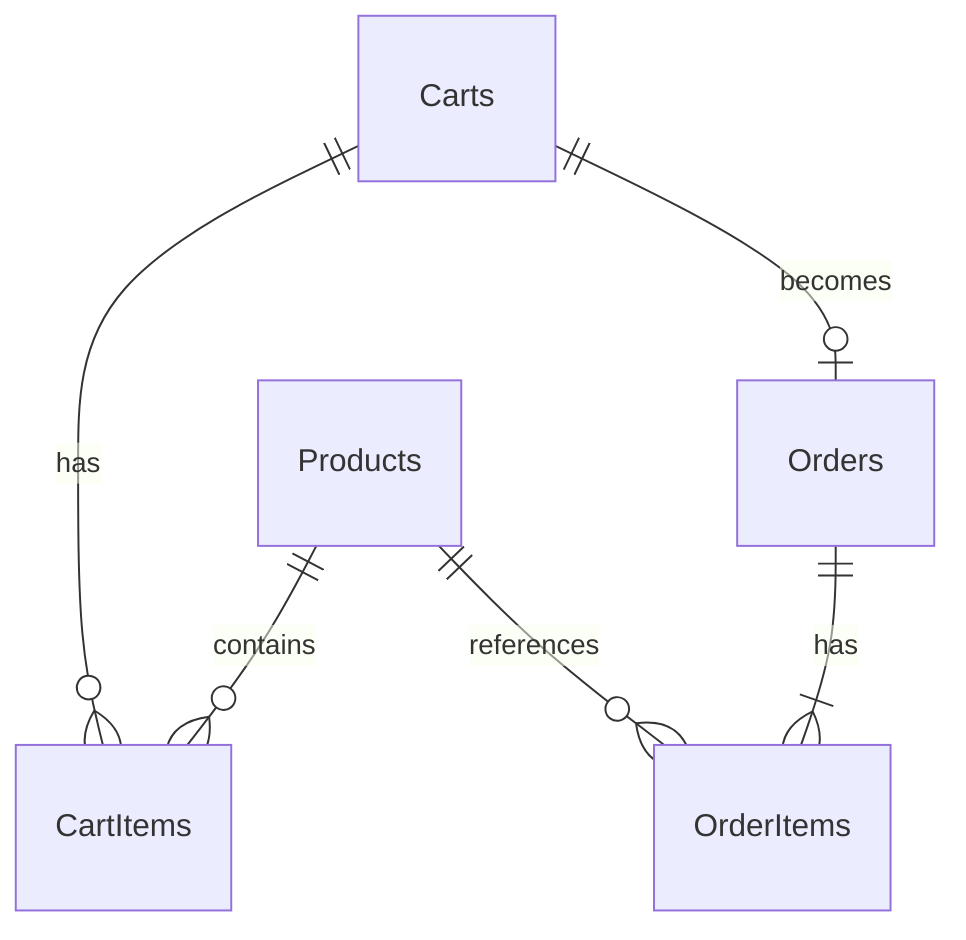

# ShopingCart — แบบทดสอบตะกร้าสินค้า

ตัวอย่างที่เน้นอ่านโค้ดแล้วอธิบายได้: **Next.js → .NET 8 REST API → BusinessLogic → Repository (Dapper) → SQLite**

## เริ่มใช้งาน


- ร้านค้า: http://localhost:3000
- Swagger สำหรับทดลอง API: http://localhost:5056/swagger
- ตรวจว่า API เปิดอยู่: http://localhost:5056/health
- หยุดแต่ละเซิร์ฟเวอร์ด้วย `Ctrl+C`


คำสั่งมาตรฐานเมื่อเครื่องพร้อม:

```powershell
dotnet run --project ShopingCart.csproj --launch-profile http
# อีก Terminal
cd frontend
pnpm install --frozen-lockfile
pnpm dev
```

ใช้ `npm install` และ `npm run dev` ได้เช่นกัน หากใช้ npm เป็นหลัก

## รันจาก Visual Studio 2022

1. เปิด `ShopingCart.sln` ที่อยู่ในโฟลเดอร์เดียวกับ README นี้
2. คลิกขวาโปรเจกต์ `ShopingCart` แล้วเลือก **Set as Startup Project**
3. เลือกโปรไฟล์ **http** ข้างปุ่ม Run แล้วกด **F5** จะเปิด Swagger ที่พอร์ต 5056
4. หน้า Next.js เปิดแยกด้วย `scripts/Start-Web.ps1` และเข้าร้านค้าที่ http://localhost:3000

## โครงสร้างที่ควรเริ่มอ่าน

```text
ShopingCart.sln                  เปิด solution นี้ (อยู่ในโฟลเดอร์เดียวกับ README)
ShopingCart.csproj               โปรเจกต์ API เดิม ใช้เป็นชั้น API
Program.cs                      ลงทะเบียนบริการ, เปิด SQLite, ตั้งค่า CORS
Controllers/                    รับ HTTP request แล้วเรียก service
Database/
  schema.sql                    โครงสร้างฐานข้อมูล 5 ตาราง
  seed.sql                      ข้อมูลสินค้าจำลอง
src/
  ShopingCart.DataContract/      Models และ Requests
  ShopingCart.Repository/        SQL ผ่าน Dapper และ DbSession
  ShopingCart.BusinessLogic/     กติกาตะกร้าและการชำระเงิน
frontend/
  app/page.tsx                  หน้าสินค้า
  app/cart/page.tsx             หน้าตะกร้า
  app/checkout/page.tsx         ตรวจยอด ชำระเงิน และใบสรุป
  components/ShopProvider.tsx    สถานะตะกร้าร่วมกันทุกหน้า
  lib/api.ts                    รวมการเรียก REST API
tests/ShopingCart.Tests/         ทดสอบกติกาด้วย SQLite จริง
Screenshot/                      รูปตัวอย่างหน้าจอและโครงสร้างฐานข้อมูล
App_Data/shopingcart.db         ฐานข้อมูลที่สร้างเมื่อเริ่ม API
```

โปรเจกต์ API คงชื่อไฟล์เดิมไว้เพื่อใช้กับโปรเจกต์ที่มีอยู่แล้ว อีกสาม layer แยกเป็น Class Library และเพิ่มใน solution ภายในโฟลเดอร์นี้

## เริ่มจากฐานข้อมูล



| ตาราง | หน้าที่ | ข้อกำหนดหลัก |
|---|---|---|
| Products | รหัส ชื่อ ราคาขาย สต็อก | Code ห้ามซ้ำ; เงินและสต็อกไม่ติดลบ |
| Carts | หัวตะกร้าและสถานะ | Id เป็น GUID; Open / CheckedOut |
| CartItems | สินค้าและจำนวนในตะกร้า | คู่ CartId + ProductId ห้ามซ้ำ; จำนวนมากกว่า 0 |
| Orders | คำสั่งซื้อที่สำเร็จ | CartId ห้ามซ้ำ เพื่อไม่สั่งซื้อซ้ำ |
| OrderItems | สำเนารหัส ชื่อ ราคา และจำนวนตอนซื้อ | เก็บประวัติแม้ข้อมูลสินค้าเปลี่ยน |

เก็บเงินด้วย INTEGER หน่วยสตางค์ เช่น 890.50 บาท = 89050 สตางค์ หน้าเว็บหาร 100 เฉพาะตอนแสดงผล ค่าเพดานใน schema เป็นขอบเขตของตัวอย่าง: ราคาไม่เกิน 1,000,000 บาทต่อชิ้น และสต็อกไม่เกิน 1,000,000 ชิ้น

| รหัส | ชื่อ | ราคาบาท | สต็อกเริ่มต้น |
|---|---|---:|---:|
| P001 | เมาส์ | 199.00 | 10 |
| P002 | คีย์บอร์ด | 590.00 | 5 |
| P003 | หูฟัง | 890.50 | 2 |
| P004 | จอภาพ | 3,990.00 | 0 |

เริ่ม API ครั้งแรกจะสร้างตารางและ seed อัตโนมัติ เปิดซ้ำจะไม่เติมสต็อกที่ขายไปแล้วกลับมา ถ้าต้องการเริ่มข้อมูลชุดใหม่ ให้หยุด API แล้วรัน:

```powershell
$env:Database__Path = 'App_Data/fresh-demo.db'
.\scripts\Start-Api.ps1
```

ใช้ชื่อไฟล์ที่ยังไม่มีเพื่อสร้างชุดใหม่ ฐานข้อมูลเดิมยังอยู่ ส่วน browser จะเริ่มตะกร้าใหม่เมื่อไม่พบรหัสเก่า

## Business

1. เพิ่มสินค้า: รวมจำนวนกับรายการเดิม และห้ามเกินสต็อก
2. ลดเหลือ 0: ลบแถวใน CartItems
3. ลบรายการ/ล้างตะกร้า: เปลี่ยนเฉพาะตะกร้า สต็อกเท่าเดิม
4. ใส่ตะกร้ายังไม่จองสต็อก ผู้ซื้ออีกคนจึงอาจซื้อสินค้านั้นก่อน
5. ชำระเงิน: ตรวจยอดล่าสุด ตรวจสต็อกทุกชิ้น สร้างคำสั่งซื้อ ตัดสต็อก ล้างและปิดตะกร้าใน Transaction เดียว
6. ถ้ารายการใดผิดพลาด ย้อนกลับทั้งหมด ตะกร้ายังอยู่และสต็อกไม่เปลี่ยน
7. ส่ง checkout ซ้ำด้วย CartId เดิม ได้คำสั่งซื้อเดิม ไม่ตัดสต็อกซ้ำ
8. ถ้าราคาเปลี่ยนจากยอดที่ผู้ซื้อเห็น ให้ตรวจยอดใหม่ก่อนยืนยันอีกครั้ง

ผู้ซื้อยังลดจำนวนได้แม้สต็อกล่าสุดจะต่ำกว่าจำนวนเดิม ส่วนการเพิ่มจำนวนและการชำระเงินต้องผ่านการตรวจสต็อก

## REST API

| Method | URL | การทำงาน |
|---|---|---|
| GET | /api/products | อ่านสินค้าและสต็อก |
| POST | /api/carts | สร้างตะกร้า |
| GET | /api/carts/{cartId} | อ่านตะกร้าและยอดรวม |
| POST | /api/carts/{cartId}/items | เพิ่มสินค้า `{ "productId": 1, "quantity": 1 }` |
| PUT | /api/carts/{cartId}/items/{productId} | ตั้งจำนวน `{ "quantity": 2 }` |
| DELETE | /api/carts/{cartId}/items/{productId} | ลบรายการ |
| DELETE | /api/carts/{cartId}/items | ล้างตะกร้า |
| POST | /api/carts/{cartId}/checkout | ยืนยัน `{ "expectedTotalSatang": 19900 }` |

ข้อผิดพลาดส่งรูปแบบ ProblemDetails: 400 ข้อมูลไม่ถูกต้อง, 404 ไม่พบข้อมูล, 409 สต็อก/ราคา/สถานะขัดแย้ง ข้อความจากกติกาธุรกิจเป็นภาษาไทย ส่วน validation ของรูปแบบ request ใช้มาตรฐาน ASP.NET หน้าเว็บแสดงข้อความให้ผู้ซื้อแก้ไขและลองใหม่

ลองเรียกตามลำดับจาก `ShopingCart.http` ได้ ราคาที่ client ส่งมาใช้เปรียบเทียบยอดเท่านั้น ราคาขายจริงคำนวณโดย API

## ทดสอบและ build

```powershell
dotnet test ShopingCart.sln
dotnet build ShopingCart.sln
# จาก frontend
pnpm typecheck
pnpm build
```

หรือใช้ `scripts/Start-Web.ps1 -Production` เพื่อ build และเปิดหน้าเว็บ production ในเครื่อง

ชุดทดสอบใช้ SQLite จริงในไฟล์ชั่วคราวแยกแต่ละ test ครอบคลุมเพิ่ม/ลด/ลบ/ล้าง, สต็อกไม่พอ, ทศนิยมราคา, ตรวจยอดจาก API, กดซ้ำ, แย่งสินค้าชิ้นสุดท้าย และจำลองให้ SQL ล้มเหลวระหว่างตัดสต็อกเพื่อยืนยัน rollback

รูปตัวอย่างหลังรันจริงอยู่ใน `Screenshot/`

## ขอบเขตตัวอย่าง

เป็นการชำระเงินจำลองและตะกร้าสำหรับผู้ซื้อทั่วไป  รหัสตะกร้าเก็บใน localStorage; ใบสรุปล่าสุดเก็บใน sessionStorage 

ค่าเริ่มต้น API อยู่พอร์ต 5056 และ frontend อยู่พอร์ต 3000 เปลี่ยน API URL ได้ด้วย `frontend/.env.local` ตาม `.env.example` และปรับ `Cors:AllowedOrigins` ให้ตรงกัน
